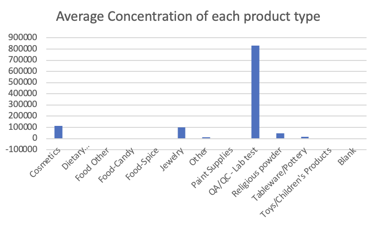

# Report of the data and the results

## Data Set Details

### Origin of the Data Set
This dataset contains the laboratory results for the consumer products that contains lead. It was sourced from the New York City Health Department.

Access the original data set here: [Data Source](https://data.cityofnewyork.us/Health/Metal-Content-of-Consumer-Products-Tested-by-the-N/da9u-wz3r)

### Format of the Original Data File
The original data was provided in CSV format, a common structure for tabular data like environmental datasets.

### Display of Raw Data
Below display some of the raw data from the original data file :

| ID | Product Type               | Product Name            | Metal | Concentration | Units | Manufacturer                 | Made In        | Collection Date          |
|----|----------------------------|-------------------------|-------|---------------|-------|------------------------------|----------------|--------------------------|
| 1  | Food-Spice                 | Turmeric powder         | Lead  | 2.9           | ppm   | UNKNOWN OR NOT STATED        | INDIA          | 2011-01-04T00:00:00.000  |
| 2  | Food-Spice                 | Cumin powder            | Lead  | 2.4           | ppm   | UNKNOWN OR NOT STATED        | INDIA          | 2011-01-04T00:00:00.000  |
| 3  | Food-Spice                 | Cumin seeds             | Lead  | 2.8           | ppm   | UNKNOWN OR NOT STATED        | INDIA          | 2011-01-04T00:00:00.000  |
| 4  | Food-Spice                 | Masala                  | Lead  | 12            | ppm   | UNKNOWN OR NOT STATED        | UNKNOWN OR NOT STATED | 2011-01-04T00:00:00.000  |
| 5  | Food-Candy                 | Tamarind Candy          | Lead  | -1            | ppm   | UNKNOWN OR NOT STATED        | UNKNOWN OR NOT STATED | 2011-01-06T00:00:00.000  |
| 6  | Food-Candy                 | Lucas Muecas candy      | Lead  | -1            | ppm   | Lucas Muecas                 | MEXICO         | 2011-01-06T00:00:00.000  |
| 7  | Jewelry                    | Amulet (Tabeez)         | Lead  | 580000        | ppm   | UNKNOWN OR NOT STATED        | BANGLADESH     | 2011-01-13T00:00:00.000  |
| 8  | Jewelry                    | String for amulet/tabeez| Lead  | -1            | ppm   | UNKNOWN OR NOT STATED        | BANGLADESH     | 2011-01-13T00:00:00.000  |
| 9  | Cosmetics                  | Surma (Hashmi)          | Lead  | 410000        | ppm   | UNKNOWN OR NOT STATED        | PAKISTAN       | 2011-01-19T00:00:00.000  |
| 10 | Food-Spice                 | Powdered red pepper     | Lead  | -1            | ppm   | UNKNOWN OR NOT STATED        | INDIA          | 2011-01-19T00:00:00.000  |
| 11 | Food-Spice                 | Turmeric (Haldi)        | Lead  | -1            | ppm   | UNKNOWN OR NOT STATED        | INDIA          | 2011-01-19T00:00:00.000  |
| 12 | Food-Spice                 | Garam masala            | Lead  | 3.2           | ppm   | UNKNOWN OR NOT STATED        | INDIA          | 2011-01-19T00:00:00.000  |
| 13 | Food-Spice                 | Garam masala            | Lead  | 3.8           | ppm   | UNKNOWN OR NOT STATED        | INDIA          | 2011-01-19T00:00:00.000  |
| 14 | Food-Spice                 | Red pepper spice        | Lead  | -1            | ppm   | UNKNOWN OR NOT STATED        | UNKNOWN OR NOT STATED | 2011-01-19T00:00:00.000  |
| 15 | Food-Spice                 | Turmeric powder         | Lead  | 610           | ppm   | UNKNOWN OR NOT STATED        | BANGLADESH     | 2011-01-21T00:00:00.000  |
| 16 | Food-Spice                 | Chili powder            | Lead  | 3.8           | ppm   | UNKNOWN OR NOT STATED        | BANGLADESH     | 2011-01-21T00:00:00.000  |
| 17 | Dietary Supplement/Medications/Remedy | Pregnita (Ayurvedic)    | Lead  | 12000         | ppm   | Ajmera Pharmaceuticals PVT. LTD. |

### Data Scrubbing Details
The dataset required several cleaning tasks before analysis, including:

- **Removing Incomplete Records**: Rows with missing values were removed.
  ```python
  cleaned_data = cleaned_data.dropna()
  ```
- **Filtering Outliers**: Data entries with unrealistic values, such as negative concentrations, were filtered out.
  ```python
  cleaned_data['CONCENTRATION_IS_NEGATIVE_ONE'] = data['CONCENTRATION'] == -1
  ```
- **Indicating High Concentration**: A new column is made to indicate if concentration exceeds 5 ppm
  ```python
  cleaned_data['HIGH_CONCENTRATION'] = cleaned_data['CONCENTRATION'] > 5
  ```

### Links to Data Files
- [Original Raw Data](data/Metal_Content_of_Consumer_Products_Tested_by_the_NYC_Health_Department_20240217.csv)
- [Munged Data](data/clean_data.csv)
- [Final Spreadsheet](data/data.xlsx)

### Aggregate statisics
The average concentration of lead across all products was calculated to understand the typical amount of lead a product might contain, which provide the central tendancy of data. The average value gives us a starting point to assess the overall exposure level to lead across all products.

The maximum concentration of lead found in any product represents the extreme end of exposure that is present in the dataset. It highlight the most extreme-case scenario in terms of lead content. Also, we can also identify outlier or special product easily from this. The identification of products with the highest lead content is critical for risk assessment and prioritization of product safety reviews.

Similar to the maximum concentration, it shows the product with the lowest lead content that can be considered the safest in terms of lead contamination. This value is essential for understanding the potential for producing products with the lowest lead content and can be used as a benchmark for industry standards.

The sum of all lead concentrations gives us the total amount of lead across all products in the dataset. When we combine it with other aggregate statistics, it can help in estimating the average concentration and the total exposure if one were to hypothetically combine all products. Also, we can have a general view of the overall impact of the products inthe dataset.

### Pivot table
| Product type                           | Average: CONCENTRATION |
|----------------------------------------|------------------------|
| Cosmetics                              | 113901.9222            |
| Dietary Supplement/Medications/Remedy  | 2051.446207            |
| Food Other                             | 38.08771429            |
| Food-Candy                             | -0.285882353           |
| Food-Spice                             | 278.9526099            |
| Jewelry                                | 98782.58468            |
| Other                                  | 11711.02178            |
| Paint Supplies                         | 0.120952381            |
| QA/QC - Lab test                       | 830000                 |
| Religious powder                       | 47333.45085            |
| Tableware/Pottery                      | 16199.70128            |
| Toys/Children's Products               | 3892.095943            |
| Blank                                  |                        |
| **Total**                              | **12837.28323**        |

The provided pivot table displays the average concentration of a contaminant for various product types. From these data, We can see at a glance the food safety and hazards of different types of product. For instance, Cosmetics and Jewelry categories show exceptionally high average concentrations, significantly above the overall average. This could indicate potential health risks associated with these products. The relatively low average concentrations in the other categories of food, paint supplies and toys/children's products indicate a low risk, but vigilance is still needed as any level of contaminants in children's products is a cause for concern.

### Chart


This chart is a more visual representation of the average concentration of lead for different product categories, which also allow us to directly compare the different types of products. It visually emphasizes the product types that may require more stringent quality control and further investigation to ensure consumer safety.